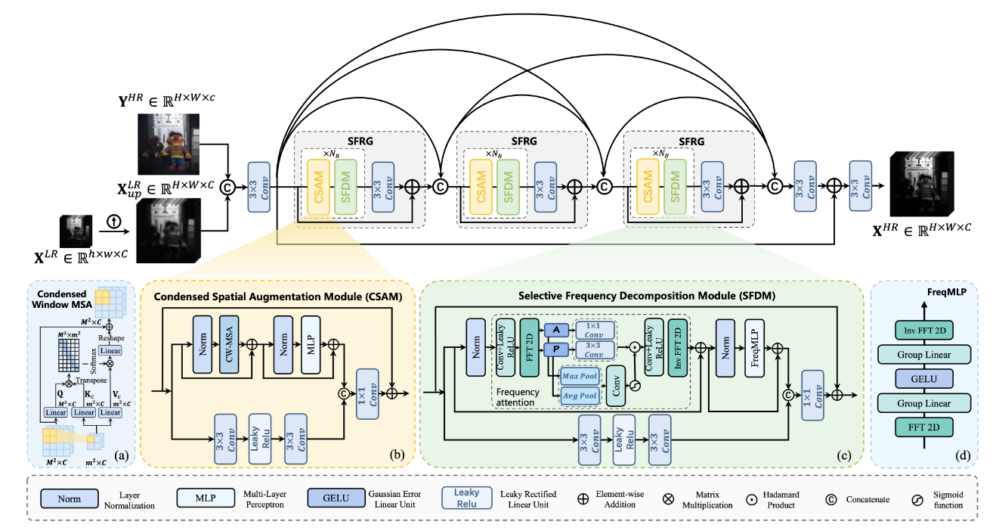
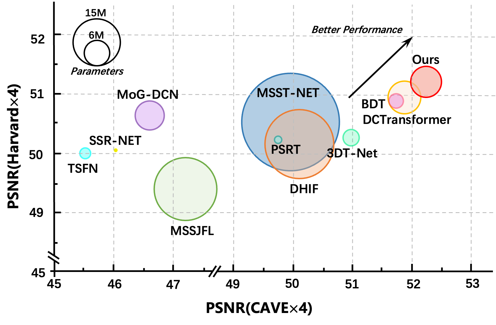
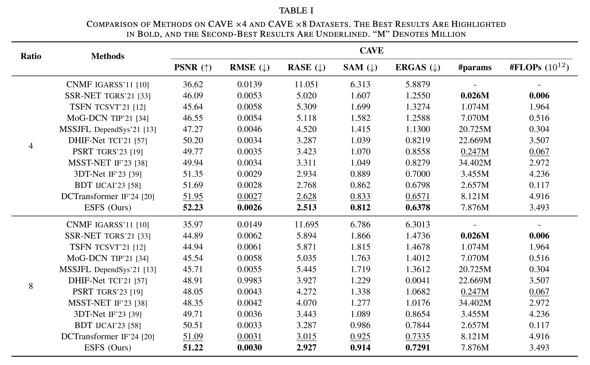
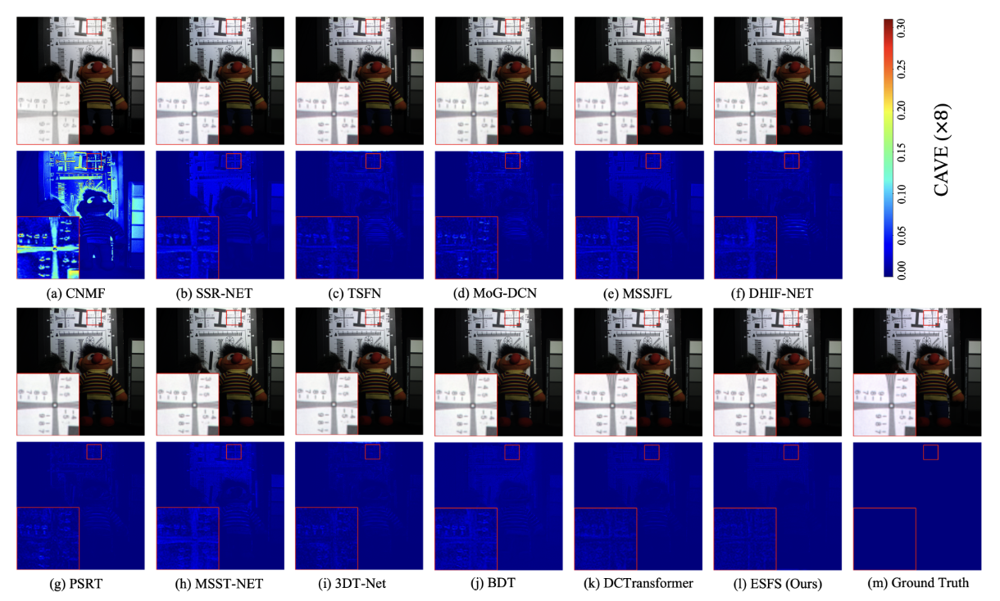

# Enhanced Spatial-Frequency Synergistic Network for Multispectral and Hyperspectral Image Fusion (ESFS)

[](https://ieeexplore.ieee.org/abstract/document/11080018)


This repository contains the official PyTorch implementation of **"Enhanced Spatial-Frequency Synergistic Network for Multispectral and Hyperspectral Image Fusion"** published in IEEE Transactions on Geoscience and Remote Sensing (TGRS) 2025.


<div align="center">

<p><em>Figure 1: Overview of the Enhanced Spatial-Frequency Synergistic Network (ESFS) architecture</em></p>
</div>

## 🏗️ Project Structure

```
ESFS/
├── model/
│   └── ESFS.py                 # Main ESFS model implementation
├── dataset/
│   ├── path_config.py          # Dataset path configurations
│   ├── Cave_dataset.py         # CAVE dataset loader
│   ├── Harvard_dataset.py      # Harvard dataset loader
│   ├── WDCM_dataset.py         # WDCM dataset loader
│   ├── GF5_S2A_dataset.py      # GF5_S2A dataset loader
│   └── dataloader.py           # Main dataloader
├── img/
│   ├── model.png               # Model architecture diagram
│   └── performance.png         # Performance comparison chart
├── argsParser.py               # Command line arguments parser
├── main.py                     # Main training script
├── trainer.py                  # Training logic
├── test.py                     # Testing script
├── utils.py                    # Utility functions
├── metrics.py                  # Evaluation metrics
└── requirements.txt            # Python dependencies
```

## 🚀 Getting Started


### Installation

**Install dependencies:**
   ```bash
   pip install -r requirements.txt
   ```

### Dataset Setup

1. **Configure dataset paths** in `dataset/path_config.py`:
   ```python
   dataset_dirs = {
       'cave': '/path/to/your/Cave_mat/',
       'harvard': '/path/to/your/Harvard_mat/',
       'WDCM': '/path/to/your/WDCM/',
   }
   ```
2. **Supported datasets:**
- **CAVE**: Columbia Multispectral Image Database (https://cave.cs.columbia.edu/repository/Multispectral)
- **Harvard**: Harvard Hyperspectral Image Database (http://vision.seas.harvard.edu/hyperspec/download.html) 
- **WDCM**: Washington DC Mall dataset (https://engineering.purdue.edu/~biehl/MultiSpec/hyperspectral.html)

## ⚙️ Configuration

The model configuration is handled through `argsParser.py`. Key parameters include:

### Model Parameters
```python
--hsi_channel 31        # Number of hyperspectral channels
--msi_channel 3         # Number of multispectral channels  
--ratio 4               # Upscaling factor
```

### Training Parameters
```python
--batch_size 4          # Training batch size
--num_epochs 200        # Number of training epochs
--lr 0.0001             # Learning rate
--step [100,150,175,190,195]  # Learning rate decay steps
--gamma 0.5             # Learning rate decay factor
```

### Dataset & Device Settings
```python
--dataset 'cave'        # Dataset choice: ['cave', 'harvard', 'WDCM', 'GF5_S2A']
--device 'cuda:0'       # Device specification
--num_workers 1         # Number of data loading workers
```

### Logging & Saving
```python
--save_dir './train/cave/4/final'  # Directory to save results
--save_every 50         # Model saving frequency (epochs)
--val_every 5           # Validation frequency (epochs)
```

## 🏃 Usage

### Training

**Basic training with default settings:**
```bash
python main.py
```

**Training with custom parameters:**
```bash
python main.py --dataset cave --batch_size 4 --lr 0.0001 --num_epochs 200 --device cuda:0
```


### Testing

```bash
python test.py
```


## 🔧 Customization

### Adding New Datasets

1. Create a new dataset class in `dataset/` following the existing patterns
2. Add dataset path to `dataset/path_config.py`
3. Update the dataset choices in `argsParser.py`
4. Register the dataset in `dataset/dataloader.py`

### Modifying Model Architecture

The main model is implemented in `model/ESFS.py`. Key components can be modified:
- Network depth and width
- Attention mechanisms
- Feature fusion strategies

## 📈 Evaluation Metrics

The project includes comprehensive evaluation metrics in `metrics.py`:
- Peak Signal-to-Noise Ratio (PSNR)
- Root Mean Square Error (RMSE)
- Relative Absolute Spectral Error (RASE)
- Spectral Angle Mapper (SAM)
- Erreur Relative Globale Adimensionnelle de Synthèse (ERGAS)


## 🏆 Performance Comparison

Our ESFS method achieves state-of-the-art performance compared to existing fusion methods:

<div align="center">

<p><em>Figure 2: Quantitative comparison with state-of-the-art methods on benchmark datasets</em></p>
</div>


## 📊 Quantitative Results on CAVE Dataset

<div align="center">

<p><em>Table 1: Quantitative comparison (PSNR, SAM, ERGAS, etc.) on the CAVE dataset.</em></p>
</div>


## 👀 Qualitative Results on CAVE Dataset

<div align="center">

<p><em>Figure 3: Visual comparison of fusion results on the CAVE dataset.</em></p>
</div>

## 📝 Citation

If you find this work useful in your research, please consider citing:

```bibtex
@article{xu2025enhanced,
  title={Enhanced Spatial-Frequency Synergistic Network for Multispectral and Hyperspectral Image Fusion},
  author={Xu, Meng and Mo, Ziqian and Fu, Xiyou and Jia, Sen},
  journal={IEEE Transactions on Geoscience and Remote Sensing},
  year={2025},
  publisher={IEEE}
}
```

## 📄 License

This project is licensed under the MIT License - see the LICENSE file for details.


## 📧 Contact

For any questions, feel free to open an issue or contact [Ziqian Mo](mailto:2310275043@email.szu.edu.cn).

## 🙏 Acknowledgments

- Thanks to the creators of the CAVE, Harvard and WDCM datasets
- Built with PyTorch and timm libraries
- Inspired by recent advances in transformer-based image fusion

---

**Note**: Make sure to update the dataset paths in `dataset/path_config.py` according to your local setup before running the code.
